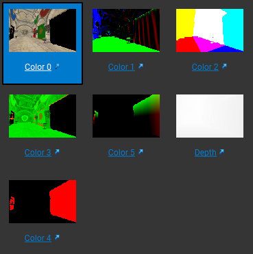

目标：实现分辨率无关的、具有较高随机访问性能、相对节省显存的矢量图渲染，使得其使用方式与传统texture类似，便于在任意形状mesh中应用矢量图贴图。

# 渲染流程

## 总体流程

1. 普通mesh将基础色、世界坐标、法线、金属度和粗糙度、彩绘编号(0)输出到gbuffer，彩绘mesh将世界坐标、法线、彩绘编号、彩绘纹理坐标输出到gbuffer；

2. compute shader根据彩绘编号、彩绘纹理坐标gbuffer来计算彩绘纹理，更新基础色、金属度和粗糙度gbuffer；

3. 根据基础色、世界坐标、法线、金属度和粗糙度gbuffer，以及光源计算光照。



后续计划实现shadow mapping。

## 计算彩绘纹理流程

彩绘由许多不同的图元组成，一个图元可以由一系列贝塞尔曲线和贝塞尔曲线封闭的图形组成，同一图元可能在彩绘中反复出现，故计算彩绘纹理的过程就是根据矢量图纹理坐标，计算像素点对应哪个图元的哪个部位，得到颜色和材质，相当于在二维平面中做光线追踪。为了加速这一过程，将图元中的一个由数条曲线围成的封闭图形拆成多个由三条曲线围成的封闭图形，对每个图形和每段不构成封闭图形的贝塞尔曲线建立BVH层次包围盒加速结构，再对每个图元建立BVH。由此，计算每个像素点的过程即为遍历两个BVH找到像素点对应的图形或曲线，对于图形，判断点是否在图形内；对于线条，判断点到曲线的距离是否小于一定值，然后根据指定的样式计算其颜色和材质。

# 二级编码结构

首先分为图元和索引两大块，图元内坐标范围为-1到1，一张图中可能有多个相同的图元，这些图元只需在图元缓存中保存一次，为了记录图元的位置和变换信息，对图元建立一个索引结构，同时为了方便求交，使用BVH层次包围盒结构，BVH每个结点包含bvhChildren（每个结点的两个儿子，x分量为左儿子，y分量为右儿子）和bound（包围盒坐标，QVector4D（左下角x，左下角y，右上角x，右上角y）），BVH的最后一个结点的左儿子为图元索引加上BVH数组长度，右儿子特殊处理为图元zIndex和逆时针旋转角度。

图元由轮廓包围的封闭图形和线条构成，轮廓可以由直线、二阶贝塞尔曲线和三阶贝塞尔曲线组成，支持任意数量轮廓围成的图形的渲染，轮廓围成的图形中不能含有空腔，对于一个复杂的含有许多轮廓的封闭图形而言，应当将其分割成数个由三段轮廓线包围的广义三角形，并对这些广义三角形以及不构成图形的线条建立BVH索引，图元内BVH索引存储在外部BVH数组后。

compute shader接收的6个buffer：

```glsl
layout(std430, binding = 1) buffer paintingOffsetBuffer
{
	/**********************
	** @[0] paintingBvhRoot
	** @[1] paintingBvhLength
	**********************/
	uint paintingOffsets[][2];
};
layout(std430, binding = 2) buffer bvhBuffer
{
	uvec2 bvhChildren[];
};
layout(std430, binding = 3) buffer bvhBoundBuffer
{
	vec4 bvhBound[];
};
layout(std430, binding = 4) buffer elementOffsetBuffer
{
	/**********************
	** @x elementBvhRoot
	** @y elementBvhLength
	** @z pointsOffset
	** @w linesOffset
	**********************/
	uvec4 elementOffsets[];
};
layout(std430, binding = 5) buffer elementIndexBuffer
{
	uint elementIndex[]; //线和面
};
layout(std430, binding = 6) buffer elementDataBuffer
{
	float elementData[]; //点和Style
};
```

提供工具类合并多张彩绘的buffer，一张彩绘的参数示例：

```c++
		GLuint paintingBvhLength = 7;
		GLuint bvhChildren[] = {
			//root
			1,2, 
			3,4, 5,6,
			7,0, 7,30./360* 4294967296 /*右儿子用来表示旋转角度*/, 8,0, 7,0,
			//elememt0
			1,2,
			5+0/*contour索引*/,5+12/*style索引，在elementData中位置*/, 3,4,
					   5+2,5+12, 5+1,5+12,
			//elememt1
			1+0/*line索引，element中第几条*/,1 + 25

		};
		QVector4D bvhBound[] = { 
			//root
			QVector4D(-1,-1,1,1),
			QVector4D(-0.9,-0.9,-0.1,0.9),  QVector4D(0.1, -0.9,0.9,0.9), 
			QVector4D(-0.8,-0.8,-0.2,-0.1),  QVector4D(-0.7,0.2,-0.2,0.7), QVector4D(0.2,-0.8,0.8,-0.1), QVector4D(0.2,0.1,0.8,0.8),
			//elememt0
			QVector4D(-1,-1,1,1),
			QVector4D(-1,-0.5,1,1),	QVector4D(-1,-1,1,0.5),
									QVector4D(-1,-1,1,-0.5), QVector4D(-1,-0.5,1,0.5),
			//elememt1
			QVector4D(-1,0,1,1),
		};

		GLuint elementOffset[] = {
			//element0
			7, //elementBvhRoot
			5, //elementBvhLength
			0, //pointsOffset
			0, //linesOffset
			//element1
			12, //elementBvhRoot
			1, //elementBvhLength
			19, //pointsOffset
			40, //linesOffset
		};

		GLuint elementIndex[] = {
			//element0
			//lines, 全部当作三阶贝塞尔, 每条线四个点索引
			0,2,2,4,
			0,0,1,1,
			1,1,4,4,
			1,1,5,5,
			4,4,5,5,
			1,1,3,3,
			3,3,5,5,
			//contours, 每个轮廓三个线索引
			0,1,2,
			2,3,4,
			3,5,6,

			//element2
			//lines
			0,1,2
		};


		GLfloat elementData[] = {
			//element0
			//points
			-1,0.5, -1,-0.5, 0,1, 0,-1, 1,0.5, 1,-0.5,
			//fillStyle
			//fill
			0, 
			//fillType
			0, //单色
			//fillColorMetallicRoughness
			1,1,0, 0,0.8,

			//element1
			//points
			-1,0.5, 0,1, 1,0.5,
			//strokeStyle
			//stroke
			1,
			//strokeWidth
			0.02,
			//strokeEndType
			0, //圆角
			//strokeFillType
			0, //单色
			//strokeFillColorMetallicRoughness
			0,1,0, 0,0.8
		};
```

fillStyle格式：

第一个元素：0，代表填充封闭图形

第二个元素：填充方式

​                       0，单色

​                       1，按直线渐变

​                       2，按点渐变

后续元素：

对于单色：5个元素分别为R，G，B，Metallic，Roughness

对于按直线渐变：起点坐标，终点坐标，段数，[{在直线中相对位置，颜色材质}, ...]

对于按点渐变：点数，[{坐标，权重，颜色材质}, ...]


strokeStyle格式：

第一个元素：1，代表画线

第二个元素：线宽

第三个元素：0，圆角

​                       1，直角

​                       2，起点圆角终点直角

​                       3，起点直角终点圆角

第四个元素：线内填充方式

​                       0，单色

​                       1，按直线渐变

​                       2，按点渐变

​                       3，按当前线条渐变

第五元素：线外描边类型

​                       0，不描边

​                       1，双侧描边

​                       2，左侧描边

​                       3，右侧描边

第六个元素：线外描边宽度

第七个元素：线外描边方式

​                       0，单色

​                       1，分层设色

​                       2，渐变

后续元素：

线内填充数据：

对于单色：5个元素分别为R，G，B，Metallic，Roughness

对于按直线渐变：起点坐标，终点坐标，段数，[{在直线中相对位置，权重，颜色材质}, ...]

对于按点渐变：点数，[{坐标，权重，颜色材质}, ...]

对于按当前线条渐变：段数，[{在线条中相对位置，权重，颜色材质}, ...]

线外描边数据：

对于单色：5个元素分别为R，G，B，Metallic，Roughness

对于分层设色：层数，[{相对宽度，颜色材质}, ...]

对于渐变：层数，[{相对位置（由里到外0~1），权重，颜色材质}, ...]

